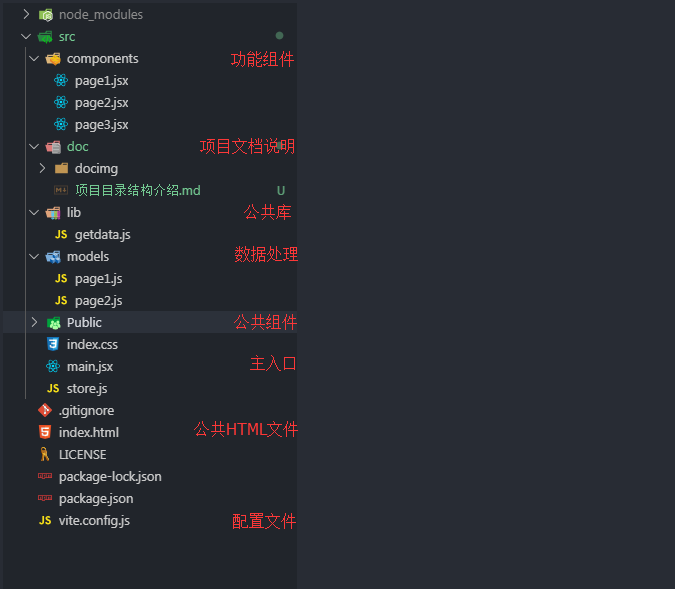

# 项目的文件目录结构及功能  

## 项目总体目录结构

项目的总体结构如图所示

项目src路径下主要包含

```components,doc,lib,models,public```这几个文件夹和
```index.css,main.jsx,store.js```文件
这些文件并不是固定的，会随着项目进行微调，但总体结构相似。


### components 功能组件
components文件夹用来存储项目的各个功能组件，例如用户管理，如果一个模块下面有若干的功能，整个模块应当用一个文件夹来包含起来，以用户模块为例。
```console  
src/components/users/Users.jsx #用户管理模块
src/components/users/addUsers.js #添加用户模块
src/components/users/delUsers.js #删除用户模块

注：export导出的是React组件的（因为React组件的名字必须大写字母命名），文件名首字母为大写。
导出的是其他类型（如函数，对象，常量）的为小写字母开头
```
### doc 文档说明
项目的说明文档均放在这里。

### lib 公共函数库
这里则存放常用的函数库，例如防抖，节流等，这类函数通常是由纯JS实现，不受框架本身的影响。可以用于处理部分逻辑功能


### public 公共组件
public与lib有些相似，都是放公共代码函数，但这里与lib不同的是public组件则为项目专用的公共组件，这里既可以放公共组件又可以放置项目的专用处理函数，命名大小写也遵循components命名规则。

### models 数据处理
models可以理解为MVC中的Model层，主要处理各种各种数据操作逻辑，redux的状态，发起请求，服务器返回数据处理都在这里。


### main.jsx 和 index.css
整个页面的入口文件，页面的路由（用于将页面分到不同的URL路径）放在main.jsx，index.css则存放需要全局的CSS代码。
store.js则为redux使用的，不用redux则可以不需要此文件
